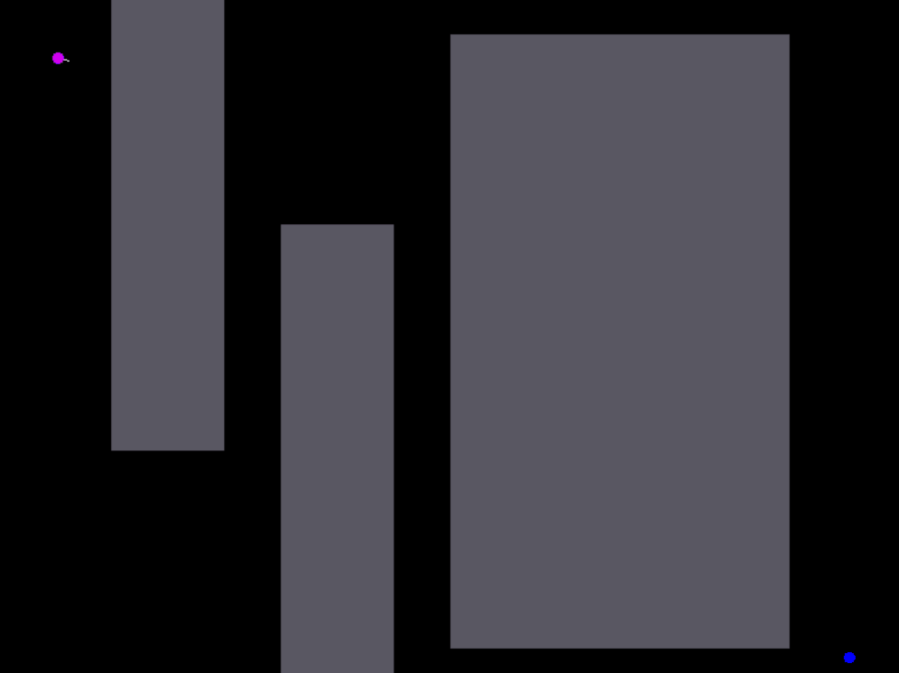
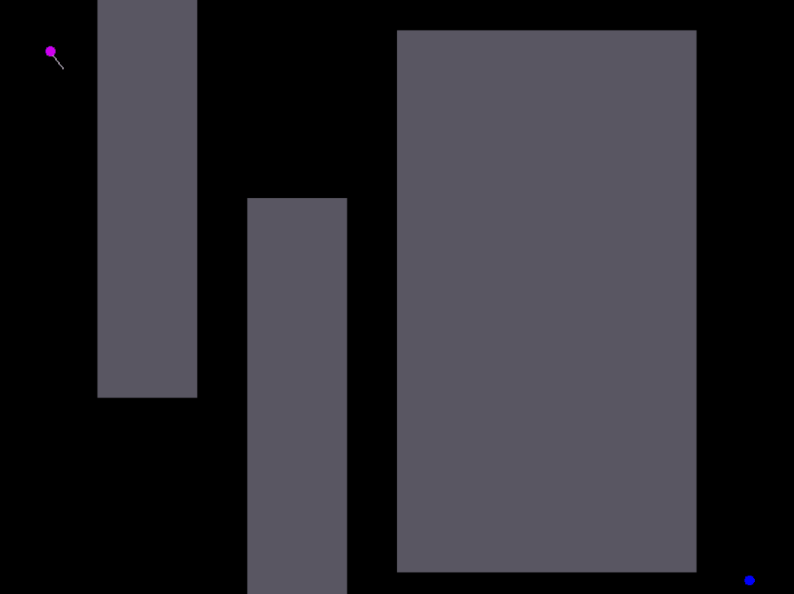

# Rapidly-Exploring-Random-Trees
My C++ implementations of RRT, RRT* and Anytime RRT (path planning algorithm used in robotics). 

## Visualization

In the following maps, pink dot represents the starting point while blue dot is the destination. Few polygonal obstacles (filled rectangles) are also present. 

### RRT

RRT is based on incremental construction of search trees which rapidly and uniformly explore the state space. The path found may not be optimal but the algorithm is probablistically complete. 


### RRT*

RRT* is an improvement over RRT. It is asymptotically optimal and probalisticaly complete. It continuously refines the paths formed to reach optimal path configuration. Due to the constant improvement, it is slower than RRT.



### *Anytime* RRT

My implementation of Anytime RRT is a combination of RRT and RRT*. First, RRT is run to find any feasible path from start to destination. Once a path is found, RRT* is run to refine the alreafy explored search space and future paths. Thus, this hybrid prioritizes finding any path at first, later optimizing its length.



## Requirements

C++ 11+ and SFML (Simple and Fast Multimedia Library) is required to run the codes. 

## Installation 

Run the following command to install SFML on Linux (For other OS, please check the guide(s) available online) 

```
$ sudo apt-get install libsfml-dev
```

## How to Run 

```
$ g++ -std=c++11 -c geometry.h rrt.cpp 
$ g++ rrt.o -o sfml-app -lsfml-graphics -lsfml-window -lsfml-system
$ ./sfml-app 
```

## Usage 

Example of interaction with the program:

```
NOTE:
Height of screen: 600 pixels. Width of screeen: 800 pixels.
Maximum distance by which algorithm jumps from one point to another: 32 units
If you would like to change of any of these, please make modifications in code
Please provide your inputs keeping this in mind. 

Which type of RRT would you like to watch? 1 for RRT, 2 for RRT*, 3 for Anytime RRT
```
```
3
```
```
Input co-ordinates of starting and ending point respectively in this format X1 Y1 X2 Y2
```
```
100 70
600 400
```
``` 
How many obstacles? 
```
``` 
2 
```
``` 
How many points in 1th polygon? 
```
``` 
4 
```
``` 
Input co-ordinates of 1th polygon in clockwise order 
```
```
200 480
200 100
250 100
250 480
```
``` 
How many points in 2th polygon? 
```
``` 
5 
```
``` 
Input co-ordinates of 2th polygon in clockwise order 
```
```
400 0
300 100
350 250
450 250
500 100
```
## Config

Configuration of the screen size, jump size of algorithm, radius of circle of starting/destination points, goal sampling probability can be changed in the rrt.cpp file in the section shown below:

```
const int WIDTH = 800 ;
const int HEIGHT = 600 ;
const int RADIUS = 5 ; 
const double GOAL_SAMPLING_PROB = 0.05;
const double INF = 1e18;

const double JUMP_SIZE = (WIDTH/100.0 * HEIGHT/100.0)/1.5;
const double DISK_SIZE = JUMP_SIZE ; // Ball radius around which nearby points are found
```
